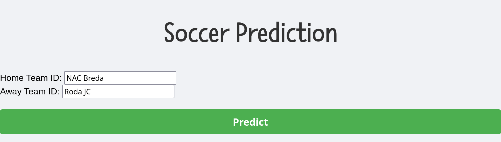

# Make it pretty

> Can you make the page look really pretty?
> Also, I'd love to use the TilburgsAns font in the header!

To make the page look pretty and use the TilburgsAns font for the header, follow these steps:

1. Add the TilburgsAns font to your project. Download the font from the official website: https://www.tilburgsans.nl/. Place the TilburgsAns-Regular.otf file in a new folder named static/fonts.
2. Create a new CSS file, static/css/styles.css, and add the following styles:

```css
@font-face {
  font-family: "TilburgsAns";
  src: url("../fonts/TilburgsAns-Regular.otf") format("opentype");
}

body {
  font-family: Arial, sans-serif;
  margin: 0;
  padding: 0;
  background-color: #f0f2f5;
}

.container {
  max-width: 800px;
  margin: 0 auto;
  padding: 40px;
  background-color: #ffffff;
  box-shadow: 0 2px 4px rgba(0, 0, 0, 0.1);
}

h1 {
  font-family: "TilburgsAns", sans-serif;
  font-size: 48px;
  color: #333;
  text-align: center;
  margin-bottom: 40px;
}

input[type="text"] {
  display: block;
  width: 100%;
  padding: 8px;
  margin-bottom: 10px;
  font-size: 16px;
  border: 1px solid #ccc;
  border-radius: 4px;
}

button {
  display: block;
  width: 100%;
  padding: 10px;
  font-size: 18px;
  font-weight: bold;
  color: #ffffff;
  background-color: #4CAF50;
  border: none;
  border-radius: 4px;
  cursor: pointer;
  margin-top: 20px;
}

button:hover {
  background-color: #45a049;
}

#result {
  margin-top: 20px;
  font-size: 18px;
  font-weight: bold;
}

#signInBtn {
  margin: 0 auto;
  display: table;
}

#signInError {
  margin-top: 10px;
}
```

This CSS file adds the TilburgsAns font, improves the layout, and applies a nicer color scheme.

3. Update the `index.html` file to include the new CSS file:

```html
<!DOCTYPE html>
<html lang="en">
<head>
  <meta charset="UTF-8">
  <meta name="viewport" content="width=device-width, initial-scale=1.0">
  <title>Soccer Prediction</title>
  <link rel="stylesheet" href="/static/css/styles.css">
</head>
<body>
  <div class="container">
    <div id="signedInContent" style="display:none;">
      <h1>Soccer Prediction</h1>
      <!-- ... -->
    </div>
    <div id="signedOutContent">
      <h1>Please sign in</h1>
      <div id="signInBtn"></div>
      <div id="signInError" style="color: red; display: none;">Failed to sign in. Please try again.</div>
    </div>
```

1. Update the Go app to serve the static files:

```go
package main

import (
  "net/http"
  // ...
)

func main() {
  // ...

  fs := http.FileServer(http.Dir("static"))
  http.Handle("/static/", http.StripPrefix("/static/", fs))

  http.HandleFunc("/", indexHandler)

  // ...
}
```

Now, the page should look prettier with a nicer layout, color scheme, and the TilburgsAns font for the header. The styles.css file can be further modified to customize the appearance of the page as desired.

## Note

I've replaced the TilburgsAns OTF file with a WOFF file, as that's what their website suggest for use on websites.

BTW, this is what ChatGPT thinks looks pretty:


